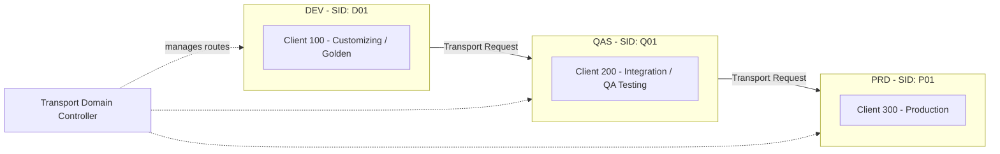
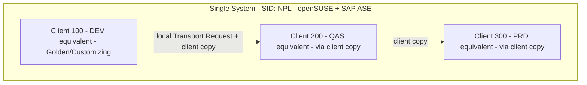

# Phase 1 — Landscape Planning

## 1. The enterprise landscape this lab is modeled on

In a real SAP shop, you never customize directly in Production. Changes flow
through a 3-system landscape, with a Transport Domain Controller managing the
routes between systems:

Each system above would normally be its own physical/virtual server, with its
own database and its own SID.

## 2. What I'm actually building, and why

Running three full SAP systems needs three DB instances and far more RAM/disk
than a personal laptop has. So this lab uses **one physical system** (SID
`NPL`, the standard SID for the AS ABAP Developer Edition trial) and
approximates the three tiers using **three clients** inside it:

**Honest limitation, documented on purpose:** a client copy on one system is
not the same as a transport moving across independently-installed systems —
there's no real Transport Domain Controller routing between separate hosts
here. What this setup *does* still teach and demonstrate: creating and
releasing transport requests (STMS), the discipline of not changing
Production directly, and client administration (client copy/compare). Phase 5
and Phase 6 call this distinction out explicitly again when I hit it hands-on.

## 3. OS and DB choice

- **Guest OS: openSUSE Leap** (exact point release pinned to whatever SAP's
  bundled installation guide specifies for 7.52 SP04). SAP's AS ABAP 7.52 SP04
  Developer Edition **must be installed on Linux** — Windows is not a
  supported target for this installer. My laptop's host OS stays Windows;
  only the VM's guest OS is Linux. This also matches real-world BASIS
  practice, where SUSE is one of the most common production OS choices.
- **Database: SAP ASE (Sybase) 16.0.** This is the DB bundled with the AS ABAP
  7.52 SP04 trial and its license file — using anything else (e.g. HANA
  Express) would mean abandoning the pre-packaged installer and building a
  from-scratch HANA integration, which is a much bigger project on its own.
  Noting HANA Express as a legitimate stretch goal for later, database-focused
  BASIS work, but out of scope for this lab.

## 4. Sizing

| Resource | SAP minimum / recommended | Allocated in this lab | Rationale |
|---|---|---|---|
| RAM | Required 4 GB, recommended 8 GB | 8 GB | Matches SAP's recommendation; host has 16 GB total, leaving headroom for Windows + VirtualBox |
| Swap (in-guest) | ~8 GB | 8 GB | Per SAP's documented requirement |
| Disk | ~100 GB server + 2 GB client | 130-150 GB (dynamic VDI) | Buffer for transports, backups, and support package patching later |
| vCPUs | Not specified | 2-4 | Matched to host core count |

## 5. Next

Phase 2 will install openSUSE Leap in VirtualBox, then run SWPM against the
downloaded AS ABAP 7.52 SP04 installation files to build system `NPL`.
